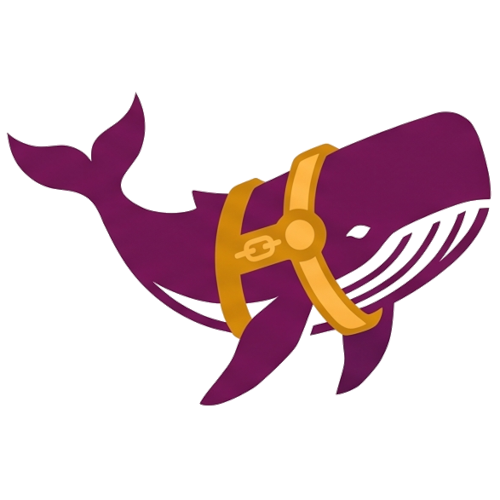

<p align="center">
  
</p>
<h1 align="center">DeepSeek Harness (DSH)</h1>
<p align="center"><b>An agentic CLI coding harness for DeepSeek models, built on Elixir &amp; Erlang/OTP</b></p>
<p align="center">
  
  
  
  
</p>

An agentic CLI coding harness for **DeepSeek** models (`deepseek-chat` V3, `deepseek-coder` V2.5, and `deepseek-reasoner` R1), built in **Elixir & Erlang/OTP**.

Derived from **José Valim's architectural framework** for process-isolated AI agents, **DeepSeek V3/R1 model architecture**, **Google Antigravity**, and **Warp Terminal TUI patterns**.

---

## Table of Contents
- [Architectural Foundation](#architectural-foundation-josé-valims-vision--deepseek-model-integration)
- [Key Features & Capabilities](#key-features--capabilities)
- [Installation & Setup](#installation--setup)
- [REPL Slash Commands & Shortcuts](#repl-slash-commands--shortcuts)
- [Configuration](#configuration)
- [Documentation](#documentation)

---

##  Architectural Foundation: José Valim's Vision & DeepSeek Model Integration

DeepSeek Harness (DSH) bridges modern LLM reasoning capabilities with Erlang/OTP's battle-tested fault tolerance and process concurrency model.

### 1. José Valim's Actor-Driven Harness Architecture
In traditional AI harnesses (typically single-threaded Node.js or Python runtimes), a tool execution error or unhandled exception can crash the entire interactive session, wiping out conversation context and active state. DSH implements José Valim's vision for agentic harnesses on the BEAM virtual machine:

- **Decoupled Brain & Hands Architecture**: The agent's cognitive state ("Brain") runs as an isolated GenServer process (`DeepSeekHarness.Brain.Session`). Tool execution ("Hands") is cleanly separated (`DeepSeekHarness.Hands.Executor`), allowing commands to execute locally, on remote Erlang nodes, or inside isolated Docker containers.
- **Fault-Tolerant Supervision**: If a tool execution or sub-task process fails, the OTP supervision tree isolates the failure without impacting the user's interactive REPL session.
- **Spatiotemporal Checkpoints & Instant Rollback**: State snapshots record conversation history, model configurations, and context state before each tool execution turn, providing temporal undo capabilities (`/undo`) and state branching.
- **Live Hot-Code Tool Reloading**: Tools and plugins can be compiled, hot-swapped, or reloaded live (`/plugins reload`) without losing conversation memory or resetting GenServer process state.
- **Lightweight Parallel Subagents**: Sub-tasks can be delegated to child session processes (`SessionSupervisor.start_session`), running parallel agentic loops concurrently across BEAM worker threads.
- **Concurrent OTP Task Engine**: Batches of tool calls (`DeepSeekHarness.TaskEngine.Orchestrator`) run concurrently under a `Task.Supervisor`, with per-file write locks and a real-time "N running" badge on the status bar ruler.
- **Distributed Erlang Node Clustering**: Hands execution can target the local host, a remote Erlang node (`/mode remote <node>`), or a Docker container (`/mode docker <id>`), decoupling where the Brain thinks from where the Hands act.

### 2. DeepSeek Model Selection & Best Practices

DeepSeek Harness supports the full suite of official DeepSeek models, local open-weights models, and third-party API aggregators. Switch models anytime via `/model <alias>` or `--model <alias>`:

| Model | ID / Alias in DSH | Best Used For | Strengths & Characteristics |
| :--- | :--- | :--- | :--- |
| **DeepSeek-V3** | `deepseek-chat`<br>`/model chat` | **Agentic workflows & multi-tool tasks** *(Default)* | 671B MoE model. Offers high general reasoning and **highest tool-calling precision** across multi-turn agent loops. |
| **DeepSeek-Coder-V2.5** | `deepseek-coder`<br>`/model coder` | **Direct code generation, syntax completion & refactoring** | Trained specifically on **338+ programming languages**. Produces idiomatic Elixir/C++/Rust code with high precision on syntax and language conventions. |
| **DeepSeek-R1** | `deepseek-reasoner`<br>`/model reasoner` | **Complex debugging & architectural design** | Reinforcement Learning (RL) reasoning model. DSH captures and streams `[DeepSeek-R1 Reasoning]` Chain-of-Thought output live before tool execution. |

---

##  Key Features & Capabilities

### 1. Persistent Session Resumption (`dsh -c <id>` & `/resume`)
- Every session is assigned a unique UUID (e.g. `df97eb34-cb33-4f21-bada-2e9c3cf75d46`).
- On exit, `dsh` prints your conversation ID:
  ```
  Resume with -c (or command below):
  dsh --conversation=df97eb34-cb33-4f21-bada-2e9c3cf75d46
  ```
- Resume any conversation across restarts with `dsh -c <id>` or interactively pick past sessions in the REPL via `/resume`.

### 2. Scoped Rule Engine (`/rules`)
- Manage prompt preambles and execution constraints.
- **Scopes**:
  - `all:` — Applied to all user prompt turns (e.g. `all: typographic quotes “” mean the exact quote`).
  - `<command>:` — Applied only when executing specific commands (e.g. `cr: format table cells multiline to fit in 80 symbols width` for `/cr`).
- Use `/rules` to list rules, `/rules add <scope: text>` to add rules, and `/rules delete` to launch the interactive checkbox modal.

### 3. Context Reference Expansion (`@`) & Smart Error Resolution
- Type `@filename`, `@/path`, `@file://...`, or `@https://...` anywhere in user prompts to attach contents.
- `@` triggers an interactive TUI file picker filtered by `.gitignore` rules (excluding `_build`, `deps`, `.elixir_ls`).
- Intelligently expands ambiguous error references ("error above", `@error`) and tracks `:open` vs `:resolved` issue status across tool calls.

### 4. Interactive Question TUI Modal (`ask_question`)
- Allows the AI model to request user feedback, clarify requirements, or present multi-choice design decisions with keyboard navigation and OK/Cancel buttons.

### 5. Model Context Protocol (MCP) & First-Class Ragex Integration
- Mount external Model Context Protocol (MCP) servers via `stdio` (JSON-RPC) or HTTP/SSE.
- Native integration with **Ragex** for SCIP code indexing, AST refactoring, and semantic code search (`/ragex`).

### 6. One-Command Global Installation & Updates
- Install globally to `~/.local/bin/dsh` via `mix dsh.install` or `install.sh`.
- Run `dsh` smoothly from **any** workspace directory.
- Perform background in-place self-updates anytime using `dsh --update` or `/update`.

### 7. Pure Console Mode (`!!`)
- Type `!!` on its own line to flip `dsh` completely out of the way: no Brain/Hands actors, no LLM turns, no slash-command dispatch -- just a bare `sh -c` passthrough with live-streamed output.
- `cd` is applied to `dsh`'s own process, exactly like a real shell builtin, so navigation persists across commands.
- Type `!!` again (or `Ctrl+D`) to flip straight back into the harness REPL -- no need to open a second terminal tab for a quick burst of plain shell commands.

### 8. Concurrent OTP Task Engine
- Tool call batches execute concurrently under `DeepSeekHarness.TaskEngine.Orchestrator`, each in its own supervised `Task`, with automatic per-file write locking to prevent concurrent edit races.
- The idle status bar surfaces a live "N running" badge with per-task summaries whenever background tool work is in flight.

### 9. Native Elixir Static Analysis (`/linter`, `/lint`)
- Runs `oeditus_credo`, `propwise`, `credo`, or `dialyzer` against the full project, a git diff, or a branch code review via `/linter <tool> [project|diff|cr] [args...]`.

### 10. Configurable Prompt Styles & Status Bar (`/config`)
- Switch prompt layout with `/config style <starship|extended|compact|minimal>` or supply a fully custom template via `/config prompt <template>`.
- Toggle UI features (`enable_autosuggestions`, `enable_syntax_highlighting`, `enable_context_gauge`, `compact_status_bar`, and more) with `/config toggle <key>`.

---

<p align="center">
  
</p>

##  Installation & Setup

This guide provides step-by-step instructions to get **DeepSeek Harness (`dsh`)** up and running on your system, along with its database backend **`dllb`** (which powers **Ragex** code analysis and knowledge graph indexing).

---

### Prerequisites (What You Need First)

Before installing `dsh` or `dllb`, ensure your machine has the following tools installed:

1. **Elixir & Erlang/OTP**: 
   - `dsh` is built using the Elixir programming language on top of the Erlang runtime engine.
   - **Required versions**: Elixir `1.19+` and Erlang/OTP `27+`.
   - *How to install*: Use your system package manager (e.g. `brew install elixir` on macOS or `sudo apt install elixir` on Ubuntu) or a version manager like [`asdf`](https://asdf-vm.com/) / [`mise`](https://mise.jdx.dev/).
2. **Git**: Required to download the project source code.
3. **C/C++ Build Tools & Libraries** *(Linux only)*:
   - Required for compiling native code dependencies: `build-essential` and `libgit2-dev`.
   - *Ubuntu/Debian command*: `sudo apt-get install -y build-essential libgit2-dev`

---

### 1. Installing `dsh` (DeepSeek Harness)

Choose **one** of the two installation methods below:

#### Option A: Quick Automated Installer (Recommended)

Run this single command in your terminal to automatically clone, build, and install `dsh`:

```bash
curl -fsSL https://raw.githubusercontent.com/Oeditus/ragec/main/install.sh | bash
```

#### Option B: Manual Installation from Source

If you prefer installing manually from the source code:

```bash
# 1. Clone the repository
git clone https://github.com/Oeditus/ragec.git
cd ragec

# 2. Fetch project dependencies
mix deps.get

# 3. Compile and install dsh globally to ~/.local/bin/dsh
mix dsh.install
```

#### Adding `~/.local/bin` to Your System `$PATH`

After installation, ensure `~/.local/bin` is included in your shell path so you can run `dsh` from any terminal directory:

```bash
export PATH="$HOME/.local/bin:$PATH"
```

> **Tip:** Add the line above to your shell configuration file (e.g. `~/.bashrc` or `~/.zshrc`) so it is available automatically in every new terminal window.

---

### 2. Installing `dllb` for `ragex` Code Indexing

#### What is `dllb` and why do I need it?
`dsh` features a powerful code intelligence engine called **Ragex** (`/ragex`). To store code symbol relationship graphs, perform fast full-text code searches, and cache project metadata across restarts, Ragex uses a lightweight, high-performance database server called **`dllb-server`** (written in Rust).

Installing `dllb-server` enables persistent, per-project database indexing.

#### Option A: Download Pre-Compiled Binary (Easiest)

1. Go to the [`dllb` GitHub Releases](https://github.com/Oeditus/dllb/releases) page.
2. Download the `dllb-server` binary for your platform (e.g., Linux or macOS).
3. Move the binary into your `~/.local/bin` directory (or any directory in your system `$PATH`) and make it executable:

```bash
# Move to local bin directory
mv dllb-server ~/.local/bin/

# Make executable
chmod +x ~/.local/bin/dllb-server
```

#### Option B: Compile `dllb-server` from Source (Rust / Cargo)

If you have the **Rust toolchain** installed (`cargo`):

```bash
# 1. Clone the dllb repository
git clone https://github.com/Oeditus/dllb.git
cd dllb

# 2. Build the optimized release binary
cargo build --release -p dllb-server

# 3. Option i: Copy the compiled binary to your PATH
cp target/release/dllb-server ~/.local/bin/

# OR Option ii: Leave it in sibling directory `../dllb/target/release/dllb-server`
```

#### How Ragex Finds `dllb-server` (Path Resolution Precedence)

When you run `/ragex` inside `dsh`, Ragex looks for the `dllb-server` executable automatically in this order:

1. **Custom Environment Variable**: `DLLB_SERVER_BIN=/path/to/dllb-server`
2. **System `$PATH`**: Directories in your `$PATH` (e.g. `~/.local/bin/dllb-server` or `/usr/local/bin/dllb-server`).
3. **Sibling Repository Path**: Relative path `../dllb/target/release/dllb-server` or `../dllb/target/debug/dllb-server`.

---

### 3. Verifying Your Installation

1. **Check `dsh` CLI**:
   ```bash
   dsh --version
   ```
2. **Start `dsh` in any project**:
   ```bash
   cd /path/to/your/project
   dsh
   ```
3. **Test Ragex Code Indexing**:
   Inside the `dsh` REPL session, type:
   ```text
   /ragex
   ```
   You should see confirmation that Ragex and the `dllb` knowledge graph backend have been successfully initialized!

---

##  REPL Slash Commands & Shortcuts

The full reference lives in [`docs/cheat_sheet.md`](docs/cheat_sheet.md); the essentials are grouped below.

#### Shell & Console
| Command | Action |
| :--- | :--- |
| `!command` | Execute shell command directly (e.g. `!git status`, `!mix test`) |
| `!!` | Flip into/out of pure console mode (plain shell passthrough, no AI/tooling) |
| `/git <subcommand>` | Run a raw `git` subcommand and print colorized output |

#### Session, History & Persistence
| Command | Action |
| :--- | :--- |
| `/resume [id]` | Resume specific session ID or open interactive conversation picker modal |
| `/session [list\|switch\|cleanup]` | Inspect, switch, or prune persisted workspace sessions |
| `/status` | Alias for `/session` -- active session & system status |
| `/checkpoint [label]` | Create a manual temporal state snapshot |
| `/undo` | Roll back state to previous temporal checkpoint |
| `/compact` | Compress conversation context to save tokens |
| `/export [json\|markdown]` | Export full session transcript to disk |
| `/history [search <query>]` | Show or search persistent REPL input history |
| `/cost` \| `/tokens` | Display token usage breakdown and cumulative session cost |

#### Git & Code Review
| Command | Action |
| :--- | :--- |
| `/cr [base]` | Generate Code Review for current branch against `main` or custom base |
| `/diff [branch]` | Display colorized git diff of workspace or against target branch |
| `/commit <message>` | Auto-stage and commit workspace changes |
| `/linter <tool> [project\|diff\|cr]` | Run `oeditus_credo`, `propwise`, `credo`, or `dialyzer` (alias: `/lint`) |

#### Model, Execution & Rules
| Command | Action |
| :--- | :--- |
| `/model [chat\|coder\|reasoner]` | Switch active model (`deepseek-chat`, `deepseek-coder`, `deepseek-reasoner`) |
| `/mode [local\|remote\|docker]` | Set Hands execution target |
| `/sandbox [on\|off]` | Restrict file references & tools to the workspace directory |
| `/permissions [auto\|ask]` | Set tool execution safety mode |
| `/rules [add\|delete\|toggle]` | Manage scoped prompt preambles and launch deletion checkbox modal |
| `/nodes` | View distributed Erlang node cluster status |

#### Tooling & Extensibility
| Command | Action |
| :--- | :--- |
| `/plugins [reload\|info]` | List tools or hot-reload plugins live without dropping state |
| `/mcp [list\|add\|load]` | Manage Model Context Protocol (MCP) servers and tools |
| `/ragex [stats\|reindex\|export]` | Mount and drive the first-class Ragex code analysis & refactoring MCP server |
| `/skills` \| `/skill <name>` | List available skills or execute a skill instruction |
| `/subagent <prompt>` | Spawn a background subagent worker for sub-tasks |
| `/config [style\|prompt\|toggle]` | Manage prompt styles and UI toggles |
| `/env` | Show runtime environment (Elixir/OTP version, model, workspace) |
| `/update` | Background self-update `dsh` release to latest code |

#### Utility
| Command | Action |
| :--- | :--- |
| `/cb` \| `/clipboard` | Copy latest assistant response to system clipboard |
| `/clear` | Clear terminal output |
| `/help` | Display help menu |
| `/exit` \| `/quit` | Exit DeepSeek Harness and print conversation resume banner |

---

## Configuration

`dsh` reads settings from `~/.dsh/config.json` (global) merged with `.dsh/config.json` (per-workspace override, taking precedence). Notable keys:

| Key | Default | Purpose |
| :--- | :--- | :--- |
| `prompt_style` | `"starship"` | Prompt layout: `starship`, `extended`, `compact`, or `minimal` |
| `permission_mode` | `"ask_confirm"` | Tool execution safety mode (`ask_confirm` or `auto_approve`) |
| `sandbox_workspace` | `false` | Restrict file references & tools to the workspace directory |
| `enable_autosuggestions` | `true` | Fish-style ghost autosuggestions from input history |
| `enable_syntax_highlighting` | `true` | Highlight `/commands` and `!shell` lines as you type |
| `enable_context_gauge` | `true` | Show the token/cost usage gauge on the idle status bar |
| `compact_status_bar` | `false` | Swap the gauge for a compact `id + message count` line |
| `max_context_tokens` | `64000` | Assumed model context window used by the usage gauge |
| `max_tool_depth` | `100` | Consecutive tool-calling turns before pausing to confirm |

Manage most of these live from the REPL with `/config style <name>`, `/config prompt <template>`, and `/config toggle <key>` -- or toggle permission mode, sandbox bounds, and the status bar mode instantly with `Ctrl+P`, `Ctrl+G`, and `Ctrl+B`.

---

## Documentation

For full command reference, keyboard shortcuts, rule scoping tactics, and advanced BEAM distribution workflows, see [`docs/cheat_sheet.md`](docs/cheat_sheet.md).

<p align="center">
  
  <br />
  <sub>DeepSeek Harness (DSH) -- Actors, Hot-Code Reloading, Distributed Brain/Hands, Spatiotemporal Checkpoints.</sub>
</p>
