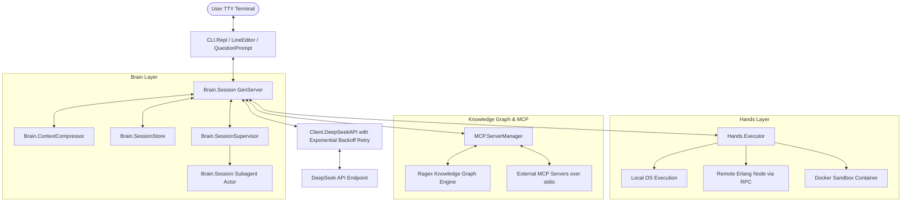

# DeepSeek Harness (DSH) — Architecture & Design

DeepSeek Harness is an autonomous, agentic CLI coding framework written in Elixir on Erlang/OTP. It pairs powerful LLM reasoning (DeepSeek-V3 and DeepSeek-R1) with BEAM actor concurrency, hot-code reloading, distributed execution, and spatiotemporal state checkpoints.

---

## High-Level Architecture Diagram

---

## Core Components

### 1. Brain Layer (`lib/deep_seek_harness/brain/`)
- **`Session` (`GenServer`)**: Manages conversation context state, model selection, permission authorization gates, temporal state snapshots, and turn execution loops.
- **`SessionSupervisor` (`DynamicSupervisor`)**: Dynamically spawns and monitors interactive user sessions and subagent worker actors.
- **`ContextCompressor`**: Summarizes long context histories when token limits or `/compact` commands are triggered.

### 2. Hands Layer (`lib/deep_seek_harness/hands/`)
- **`Executor`**: Dispatches tool calls across execution targets (`:local`, `:remote` Erlang nodes, `:docker` container sandboxes). Enforces workspace sandbox bounds when `/sandbox` is enabled.

### 3. Knowledge Graph & MCP (`lib/deep_seek_harness/mcp/`)
- **`ServerManager`**: First-class supervisor for the `Ragex` code intelligence engine and external Model Context Protocol (MCP) servers over stdio JSON-RPC. Automatically builds dynamic Elixir tool modules for live hot-code tool access.

### 4. Client Layer (`lib/deep_seek_harness/client/`)
- **`DeepSeekAPI`**: Handles REST communications with `deepseek-chat` (V3) and `deepseek-reasoner` (R1) API endpoints with automatic exponential backoff retry for transient network and rate-limit HTTP errors.

### 5. CLI & TUI Layer (`lib/deep_seek_harness/cli/`)
- **`LineEditor`**: Fixed bottom command bar TUI with horizontal ruler, grapheme-aware Unicode cursor navigation, and persistent history.
- **`QuestionPrompt`**: In-place interactive terminal modal for single-choice and multi-choice questions with multi-line text wrapping and pixel-perfect border alignment.
